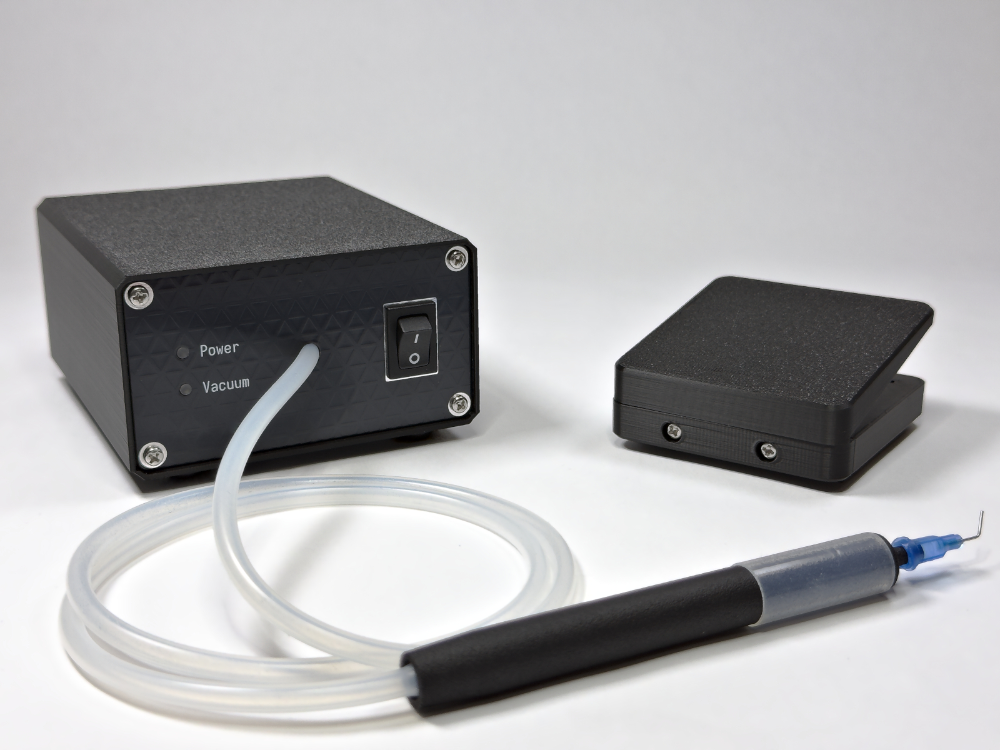

# MiniPic: Benchtop Vacuum Tweezers

[-008000?style=for-the-badge&logo=shopify&logoColor=white)](https://arenarobotics.store/products/minipic?variant=54529778090197&utm_source=github&utm_medium=readme&utm_campaign=minipic_repo&utm_content=assembled_badge)
[-0000FF?style=for-the-badge&logo=shopify&logoColor=white)](https://arenarobotics.store/products/minipic?variant=54529778122965&utm_source=github&utm_medium=readme&utm_campaign=minipic_repo&utm_content=kit_badge)

Open-source vacuum tweezers built for repairability. Engineered for SMD soldering and precision rework, with a robust design adaptable to any application requiring controlled suction and handling of small parts.

---

### Features

* **Two operating modes:** foot pedal starts or stops the vacuum motor
* **Solenoid valve** for instant component release
* **Heat-resistant pen** rated up to **160°C**
* **Full set of precision needles and suction cups** for all sizes of SMD components
* Handles components down to **0201 (0.6 x 0.3mm)** and up to **100g**
* **Flexible silicone** vacuum tubing
* **MX hot-swap mechanical switch** in the foot pedal
* **Slip-resistant** rubber feet
* **Inline filter** to protect the vacuum motor
* **LED status indicator** for vacuum engagement

---

### Documentation & Source Files

* **[Assembly Manual](./docs/ASSEMBLY_MANUAL.pdf)** - Step-by-step kit assembly Instructions & quickstart guide
* **[BOM](./BOM.csv)** - Bill of materials including reference links for purchase
* **[Electronics Source](./electronics)** - KiCAD projects for PCBs
* **[CAD Exports](./cad/exports)** - CAD export files (step)
* **[CAD Source](./cad/source%20files)** - CAD source files (FreeCAD)

---

### Our Story

Last summer, we founded a company developing advanced electronics for robot combat competitions. We were inexperienced and didn’t understand the market so the project didn’t work out. Throughout the project, we spent a lot of time designing and assembling PCBs on a tight budget. Like many others, we found that tweezers were cumbersome tools for placing SMD components. The search for a better alternative led us to vacuum tweezers, tools designed to pick and place SMD components using controlled suction. The plan was to buy something off the shelf, but all of the products that were in our price range were not usable. On the other hand, the existing professional tools would have drained our bank account. We were stuck between cheap, low quality options and expensive industrial tools, most of which lacked all the features we were actually looking for.

Out of this frustration, one of our team members got to work, and in a few days, we had a functional tool that made assembly faster and easier than before. After using it ourselves, we realized we could provide a better alternative to others facing the same lack of options. Using our prototype as inspiration, we redesigned our vacuum tweezers from the ground up. Highly functional while still remaining simple and repairable.

See MiniPic in action at: [arenarobotics.store](https://arenarobotics.store?utm_source=github&utm_medium=readme&utm_campaign=minipic_repo&utm_content=story_link).

---

### Licensing

* **Hardware & CAD files (`/electronics`, `/cad`):** Licensed under [CERN-OHL-S-v2](LICENSE.md).
* **Documentation & Media (`/docs`):** Licensed under [CC BY-NC-ND 4.0](https://creativecommons.org/licenses/by-nc-nd/4.0/).
* **Branding & Trademarks:** "MiniPic" and "ARENA Robotics" are trademarks of ARENA Robotics LLC. All rights reserved.

--- 

*Designed & Built by ARENA Robotics.*
